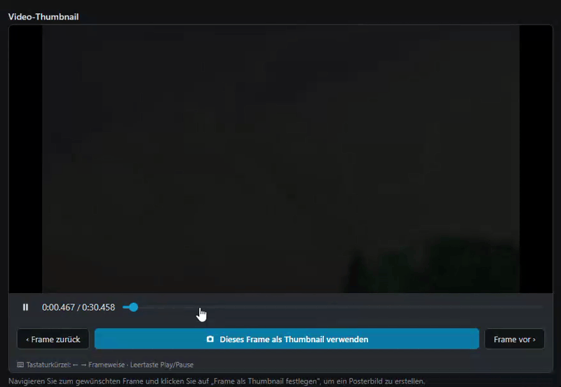

# Contao Video Thumbnail Bundle

Allows editors to capture a video frame as thumbnail/poster image directly in
the Contao file manager - no ffmpeg or server-side binary required.

---

## Screenshot



---

## Requirements

- [Contao](https://github.com/contao/contao) **5.3 or newer**

---

## Installation

Via **Contao Manager** or **Composer**:

```bash
composer require numero2/contao-video-thumbnail
```

---

## How it works

When editing a video file (`.mp4`, `.webm`, etc.) in the Contao file manager,
an additional palette appears with a browser-native `<video>` player. Editors
navigate to the desired frame using the frame-step buttons, click
**"Frame als Thumbnail festlegen"**, and save the form. The bundle then:

1. Decodes the captured JPEG from the hidden form field.
2. Writes a `{basename}-poster.jpg` file **in the same folder** as the video
   via Contao's `VirtualFilesystem` (DBAFS sync happens automatically).
3. Stores the poster file's UUID in the new `tl_files.videoThumbnail` column.

In the frontend, the bundle overrides the core `player.html.twig` template.
When the player content element has **no explicit poster** set, the template
automatically injects the captured thumbnail as the `poster` attribute on the
`<video>` element. An explicit poster on the content element always takes
precedence.

The file manager list view shows a green badge on videos that already have a
thumbnail, plus an optional client-side toggle to display only those files.

---

## Known limitations

- **Client-side only**: The frame capture runs entirely in the browser via
  `<canvas>`. Quality depends on the browser's video decoder; encrypted or
  DRM-protected streams cannot be captured.
- **Public files only**: The video must be accessible via a public URL for the
  browser to load it into the `<video>` element.